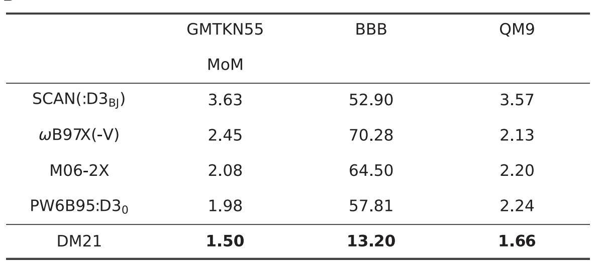
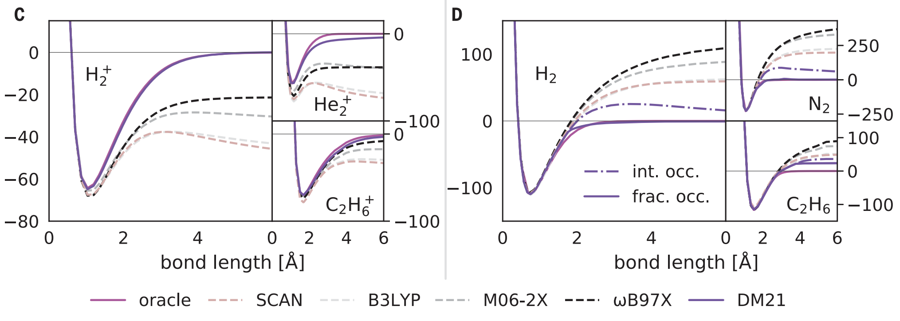
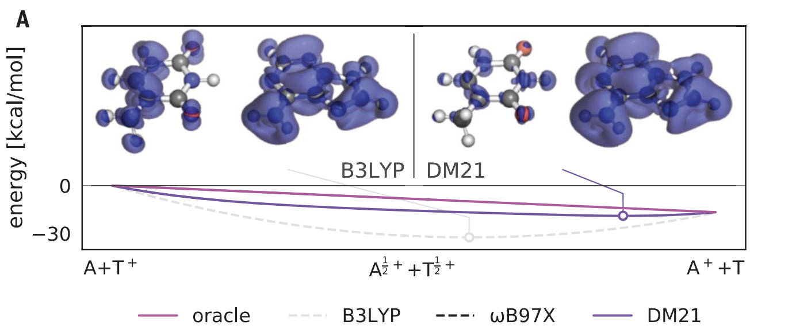
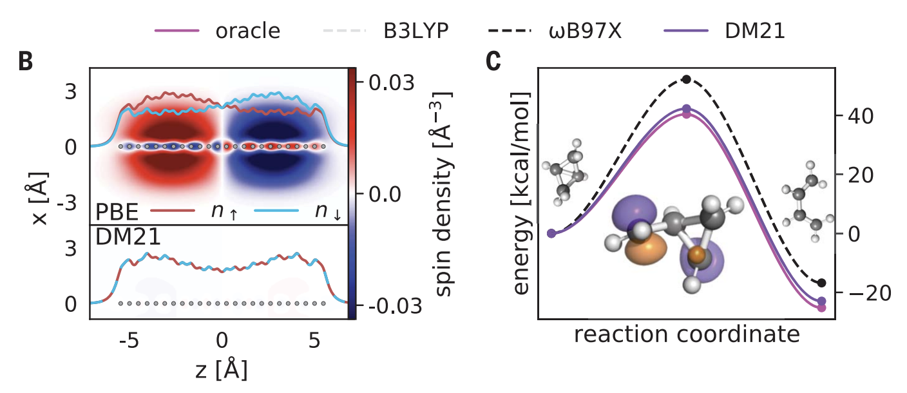
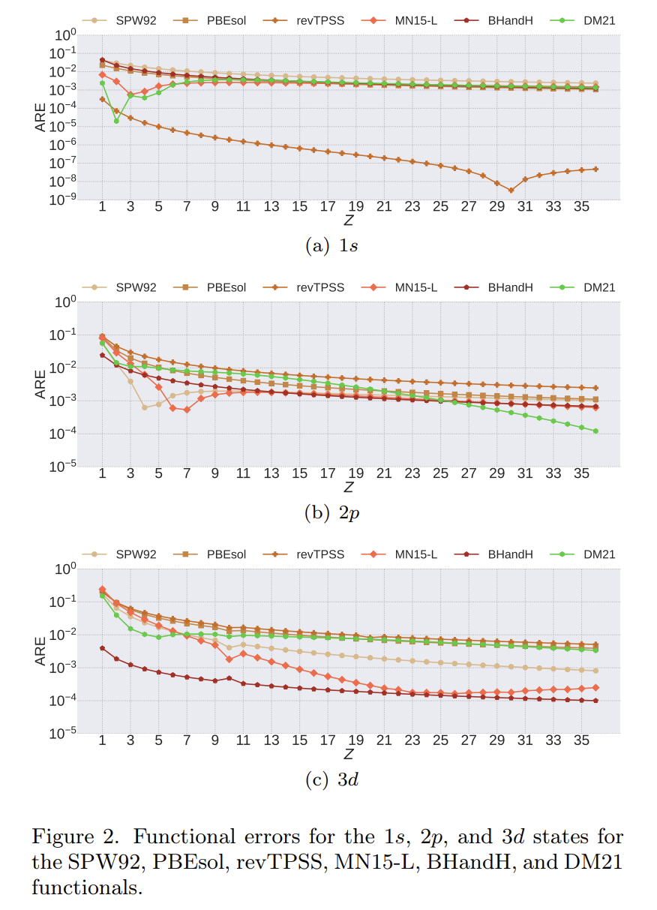

# Pushing the frontiers of density functionals by solving the fractional electron problem
with transformer (or multilayer perceptron)
> https://www.science.org/doi/10.1126/science.abj6511

## Overview
### Background
Molecular modeling is a promising with to understand and design everything made out of molecules.

What does a molecular model looks like? atomic geometry & electronic structure

How to model a molecular? Energy calculation -> one of the method: DFT

DFT is already successful but have limitation: violation of mathematical properties in all popular approximations -> limited performance in special systems.

### Problem
Eliminate some limitation in accuracy of DFT calculation:
- Solve pathological errors from violation of exact conditions for systems with fractional electrons in existing functionals to enhance the **accuarcy**.
- from 0 to 1 in some application system.

### Approach

DFT 101

- Time-indenpendent Schrödinger Equation (TISE)

  ${\hat {H}}\Psi = E\Psi$ this gives energy

- TISE for molecule

  ${\hat {H}}\Psi =\left[{\hat {T}}+{\hat {V}}+{\hat {U}}\right]\Psi = \left[\sum_{i=1}^{N}\left(-{\frac {\hbar^{2}}{2m_{i}}}\nabla_{i}^{2}\right) + \sum_{i=1}^{N} V(\mathbf {r_i})+ \sum_{i \lt j}^{N}U\left(\mathbf {r_i},\mathbf {r_j}\right) \right]\Psi =E\Psi$

  limition in solving the many-body problem limits its solution.

- Hohenberg–Kohn theorems

  - electronic density can give wavefunction

    $\Psi_{0}=\Psi [n_{0}]$

    $O[n_{0}]={\big \langle }\Psi [n_{0}]{\big |}{\hat {O}}{\big |}\Psi [n_{0}]{\big \rangle }$
  - defines an energy functional for the system and proves that the ground-state electron density minimizes this energy functional

    $E[\rho ]=T_{s}[\rho ]+\int d\mathbf {r} \,v_{\text{ext}}(\mathbf {r} )\rho (\mathbf {r} )+E_{\text{H}}[\rho ]+E_{\text{xc}}[\rho ]$

- Self-consistent field

  $\left[-\frac{\hbar^2}{2m}\nabla^2+V_s(\vec r)\right] \phi_i(\vec r) =  \epsilon_i \phi(\vec r)$

  $n(\vec r )\equiv n_s(\vec r)=\sum_i^N \left|\phi_i(\vec r)\right|^2$

  $V_s = V +\int \frac{e^2n_s(\vec r\,')}{|\vec r-\vec r\,'|} {\rm d}^3r'+ V_{\rm XC}[n_s(\vec r)]$

  1. inital guess of $n(\vec r)$
  2. calculate $\V_s$ from DFT functional
  3. calculate $\phi_i(\vec r)$ or that $n(\vec r)$ from K-S equation
  4. do this until converge

- Train a new functional that obeys two classes of mathematical constraints with fractional electrons.
- Only the exchange-correlation term $E_{ex}$ was learned and interfaced to a standard Kohn-Sham DFT code (PySCF).

#### Code demo
[Colab notebook](https://colab.research.google.com/drive/1wl7wB1vNYKgYIdsWwKryCs-DX1lZWURv?usp=sharing)

#### dataset
fixed densities of reactant and product (by B3LYP) -> reaction energy (by experiment or CCSD(T)/CBS) 

#### Architecture (formal pseudocode)
**Input:** $\mathbf {n} \in \mathbb {R}$, spatial grid representation of a fixed electronic density of a molecule (it will not do SCF in training)

**Output:** $E \in \mathbb {R}$, the electronic energy of the givin fixed density

**Hyperparameters:** 

**Parameters:** $W_{mlp} \in \mathbb {R^d}$

1 for $n_r$ in $\mathbf {n}$:

2 &emsp; $\mathbf x_r \leftarrow HFfeature(r, \mathbf {n}, \uparrow)$ &emsp; $[\mathbf x_r \in \mathbb {R^{11}}]$

3 &emsp; $\mathbf x_r^\prime \leftarrow log(|\mathbf x_r| + \eta)$, element-wise squash

4 &emsp; $\mathbf a \leftarrow tanh(W_0\mathbf x_r^\prime + b_0)$ &emsp; $[\mathbf a \in \mathbb {R^{256}}]$, activation

5 &emsp; for $l = 1,2,...,L$ do

6 &emsp; &emsp; $\mathbf {a_r} \leftarrow ELU(W_{mlp}^l\mathbf {a} + b_{mlp}^l)$

7 &emsp; &emsp; $\mathbf {a_r} \leftarrow layer\_norm(\mathbf {a}|\gamma_l,\beta_l)$

8 &emsp; $\mathbf f_{\theta,r,\uparrow} \leftarrow sigmoid(W_{-1}\mathbf x_r^\prime + b_{-1})$ &emsp; $[f_{\theta,r,\uparrow} \in \mathbb {(0,2)^{3}}]$

9 &emsp; Run same for $\downarrow$ and get a set of $f_{\theta,r,\downarrow} \in \mathbb {(0,2)^{3}}$

10 &emsp;$f_{\theta,r} = 0.5 (f_{\theta,r,\downarrow} + f_{\theta,r,\uparrow})$

12 $E_{xc}^{MLP} = \int \mathbf f_{\theta}(r)* \begin{bmatrix}  e_x^{LDA}(r)  \\\\  e_x^{HF}(r)  \\\\  e_x^{\omega HF}(r)  \\\\ \end{bmatrix} \mathrm{d}^3r$

10 $E_{xc}^{DM21} = E_{xc}^{MLP} + E_{D3(BJ)}$

### Significance
- Provide a new paradigm for DFT design.
- In general, outpreforms popular hand-made functionals in all datasets.

  

  Especially, 
  - in bond breaking benchmark (BBB), accuratly described systems with fractional charge (FC) and fractional spin (FS).
  - in mindless benchmark subset (MB16-43), accuratly described systems with out-of-distribution exotic geometries. (randomly generated)

  In cases where traditional DFTs are expected to be bad,
  - correctly described bond breaking for charged and closed-shell neutral molecules
    
  - correctly described charge delocalization in the DNA base pair
    
  - magnetic properties of a compressed hydrogen chain
  - reaction barrier heights for a ring-opening intermediate with diradical character
    

## Analysis
### Overlooked
speed (near dlpno-CCSD(T))
### Further development
speed
non-main group element
### Disputed part
doubt
- leaking of the training set in test set of BBB
- generalization part all have problems

response
- do leaking but have other part not leaking proving the fact
-  no examples that it is really bad at generalization.

Inconsistant performance shown by a recent study [6].
- The trend of DM21 changes several times with the increase of the atomic number

## Questions
### Q1
Why dont they directly learn from structure - energy data?

Answer

People have had many tries on it and the ability to generilize the model is the core problem.

### Q2

## Resource (done)

[1] DM21 repo https://github.com/deepmind/deepmind-research/tree/master/density_functional_approximation_dm21

[2] Comment on the paper from John P. Predew https://www.science.org/doi/10.1126/science.abm2445

[3] The doubt from Gerasimov et al. https://www.science.org/doi/10.1126/science.abq3385

[4] The author's reponse of the doubt https://www.science.org/doi/10.1126/science.abq4282

[5] The deepmind blog about this paper https://www.deepmind.com/blog/simulating-matter-on-the-quantum-scale-with-ai

[6] A study shows the inconsistancy of DM21 on one-electron systems https://arxiv.org/pdf/2208.06482.pdf

[7] Intro to DFT theory https://www.youtube.com/watch?v=Ez_Fm4iTUeo

## Video
